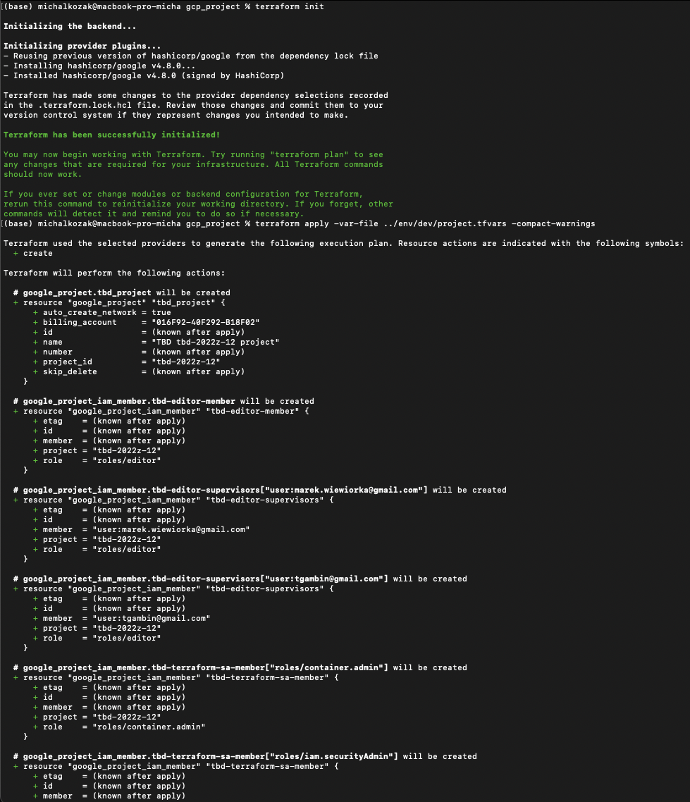
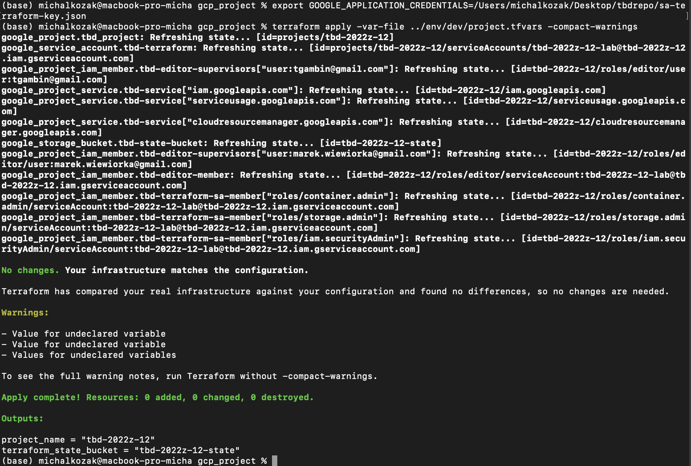
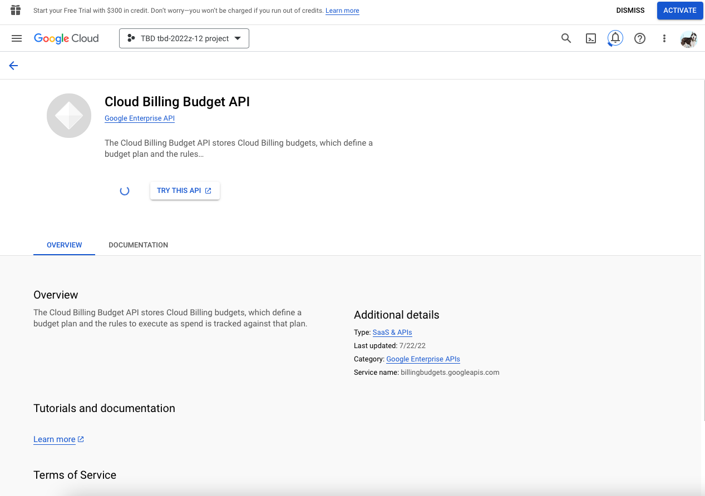
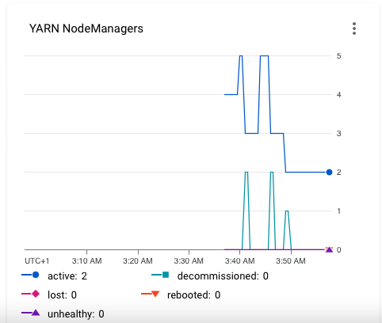

# Etap 1a
<details>
  <summary>Nadawanie zespołowi uprawnień Billing Account Administrator </summary>
  
  
  
  
  
</details>
<details>
  <summary>Efekt instalacji Terraform - wersja</summary>
  
  
  
</details>
<details>
  <summary>Dodanie zmiennych oraz wykonanie terraform init</summary>
  
  
  
</details>

<details>
  <summary>Terraform apply rezultat</summary>
  
  
  
  
  
</details>
<details>
  <summary>Zawartość plików backend i project .tfvars</summary>
  
  
  
  
</details>

<details>
  <summary>Wygenerowanie klucza, revoke oraz fail auth - rezultaty</summary>
  
  
  
  
  
</details>
<details>
  <summary>Export google credentials (key) and terraform apply z nowym kluczem - rezultaty</summary>
  
  
  
</details>
<details>
  <summary>Reconfigure (w tym problem dla architektury M1 Apple i rozwiązanie + finalny efekt)</summary>
  
  
  
  
  
  
</details>

<details>
  <summary>Terraform apply rezultat</summary>
  
  
  
</details>
<details>
  <summary>Gloud config i gloud auth activate - rezultat</summary>
  
  
  
  
</details>
<details>
  <summary>Uruchomienie job dataproc - rezultat</summary>
  
  
  
</details>
<details>
  <summary>Gsutil wyników z k8s i dataproc</summary>
  
  
  
  
</details>
<details>
  <summary>Przykładowe dodanie edytora do projektu</summary>
  
  
  
</details>
<details>
  <summary>(ZADANIE!) Sposoby odwoływania się do modułów Terraform wykorzystywane w projekcie</summary>
  
  Do 3 modułów odwołujemy się w projekcie w ten sam sposób - poprzez deklarację ich w pliku main.tf (folder główny) i wskazanie źródła np:
  ```
  module "dataproc-pyspark-job" {
  source         = "./modules/dataproc-pyspark-job"
  project_name   = var.project_name
  region         = var.region
  staging_bucket = google_storage_bucket.tbd-staging-bucket.name
  py_file        = "gs://${google_storage_bucket_object.pyspark_job_file.bucket}/${google_storage_bucket_object.pyspark_job_file.name}"
}
  ```
  Do modułu k8s-spark-operator odwołujemy się poprzez deklarację w pliku main.tf i wskazanie źródła (plików main.tf i innych.) jako repozytorium Github tj.
  ```
  module "k8s-spark-operator" {
  depends_on = [module.gke]
  source     = "github.com/biodatageeks/sequila-cloud-recipes.git?ref=0.1.2/modules/kubernetes/spark-on-k8s-operator"
  providers = {
    helm = helm.gke
  }
}
  ```
</details>
<details>
  <summary>(ZADANIE!) Wylistowanie modułów</summary>
  
  
  
</details>
<details>
  <summary>(ZADANIE!) Grafy dla modułów</summary>
  
  ##Dla folderu głównego:
  
  ##Dla modułu data-generator:
  
  ##Dla modułu dataproc-pyspark-job:
  
  ##Dla modułu gke:
  
  ##Dla modułu k8s - dołączonego za pomocą linka do repozytorium Github:
  
  ##Graf dla folderu/podprojektu gcp_project
  
  ##Graf dla folderu/podprojektu projekt3 (Wykorzystany w ostatnim zadaniu dot. polityki autoskalowania)
  
  
</details>
<details>
  <summary>(ZADANIE!) Charakteryzacja każdego z modułów: (krótka)</summary>

1)data-generator
Korzysta z 3 zasobów:
random_integer - do wygenerowania liczby z zakresu 100 - 5000
random_string - do wygenerowania losowego ciągu tekstu o wskazanej długości, korzysta z output z zasobu random_integer 
local_file - do tworzenia pliku o wskazanej zawartości (zapisu w systemie plików).

Moduł korzysta z lokalnych zmiennych do wygenerowania odpowiedniej zawartości pliku do zasobu local_file.
Wyjście z modułu to liczba lini w wygenerowanym pliku oraz jego nazwa/ścieżka.

2)dataproc-pyspark-job
Tworzenie klastra dataproc do uruchomienia odpowiedniego skryptu napisanego w języku Python wykorzystując Sparka(PySpark)

3)gke
Tworzenie klastra Google Kubernetes Engine do uruchomienia odpowiedniego skryptu napisanego w języku Python wykorzystując Sparka(PySpark).

4)k8s-spark-operator (pobierany z github)
Operator Kubernetes dla Apacha Spark wykorzystujący Helm - ma na celu sprawienie, określanie i uruchamianie aplikacji Spark w taki sposób aby było proste i idiomatyczne, jak uruchamianie innych obciążeń na Kubernetes. Wykorzystuje niestandardowe zasoby Kubernetes do określania, uruchamiania i wyświetlania stanu aplikacji Spark.
  
</details>
<details>
  <summary>(ZADANIE!) Dodanie budżetu w konsoli GCP</summary>
  
  
  
  
  
  
  Pokaz stanu budżetu po pewnym czasie:
  
</details>
<details>
  <summary>(ZADANIE! - dodatkowe?) Dodanie budżetu za pomocą terraform</summary>
  
  Niżej przedstawione zostały problemy i wykorzystane rozwiązania:
  
  
  
  
  
  
  
  Efekt ustawienia nowego budżetu:
  
  
  Opis budżetu: (weryfikacja poprawności)
  
  
  
  Można zauważyć że budżet znika po terraform destroy ...
  
  
  Kod (dodatek do pliku main.tf - linie dopisane do pliku):
  
  ```
  ####### Dodanie budżetu wykorzystując terraform
data "google_billing_account" "account" {
  billing_account = var.billing_account
}


data "google_project" "project" {
}

resource "google_billing_budget" "budget" {
  billing_account = data.google_billing_account.account.id
  display_name    = "gcp_project2"

  budget_filter {
    projects = ["projects/${data.google_project.project.number}"]
    credit_types_treatment = "EXCLUDE_ALL_CREDITS"
  }

  amount {
    specified_amount {
      currency_code = "USD"
      units         = "50"
    }
  }
  

  threshold_rules {
    threshold_percent = 0.5
  }

  threshold_rules {
    threshold_percent = 0.8
  }

   threshold_rules {
    threshold_percent = 1.0
  }

  all_updates_rule {
    monitoring_notification_channels = [
      google_monitoring_notification_channel.notification_channel.id,
    ]
    disable_default_iam_recipients = false
    schema_version = 1

  }
}

resource "google_monitoring_notification_channel" "notification_channel" {
  display_name = "Example Notification Channel"
  type         = "email"

  labels = {
    email_address = "michaldao53@gmail.com"
  }
}
  ```
</details>

<details>
  <summary>(ZADANIE!) Powołany klaster dataproc dla podprojektu, polityka autoscalowania i uruchomiony job pysparkowy, demonstracja działania polityki poprzez wizualizację zmiennej liczby wykorzystywanych węzłów</summary>
  
  Udzielenie pozwolenia na monitorowanie
  
  
  Zauważyć można zmieniającą się liczbę wykorzystanych węzłów
  
  
  Kod main.tf i na końcu variables.tf:
  
  ```
  locals {
  project = "${var.tbd_semester}-${var.group_id}"
}
provider "google" {
  project = local.project
  region  = var.region
}
resource "google_dataproc_cluster" "mycluster" {
  name   = "dproc-cluster-unique-name"
  region = var.region
  cluster_config {
    autoscaling_config {
      policy_uri = google_dataproc_autoscaling_policy.asp.name
    }
    worker_config {
      num_instances    =  4
      disk_config {
        boot_disk_size_gb = 30
        num_local_ssds    = 1
      }
    }
}
}


resource "google_dataproc_autoscaling_policy" "asp" {
  policy_id = "dataproc-policy"
  location  = var.region

  worker_config {
    min_instances = 2
    max_instances = 20
  }
  secondary_worker_config {
    min_instances=0
    max_instances = 4
    
  }
  basic_algorithm {
    yarn_config {
      graceful_decommission_timeout = "30s"

      scale_up_factor   = 0.5
      scale_down_factor = 0.5
    }
  }
}


# Submit an example spark job to a dataproc cluster
resource "google_dataproc_job" "spark" {
  region       = google_dataproc_cluster.mycluster.region
  force_delete = true
  placement {
    cluster_name = google_dataproc_cluster.mycluster.name
  }

  spark_config {
    main_class    = "org.apache.spark.examples.SparkPi"
    jar_file_uris = ["file:///usr/lib/spark/examples/jars/spark-examples.jar"]
    args          = ["220000"]

    properties = {
      "spark.logConf" = "true"
    }

    logging_config {
      driver_log_levels = {
        "root" = "INFO"
      }
    }
  }
}

# Submit an example pyspark job to a dataproc cluster
resource "google_dataproc_job" "pyspark" {
  region       = google_dataproc_cluster.mycluster.region
  force_delete = true
  placement {
    cluster_name = google_dataproc_cluster.mycluster.name
  }

  pyspark_config {
    main_python_file_uri = "gs://dataproc-examples-2f10d78d114f6aaec76462e3c310f31f/src/pyspark/hello-world/hello-world.py"
    properties = {
      "spark.logConf" = "true"
    }
  }
}

# Check out current state of the jobs
output "spark_status" {
  value = google_dataproc_job.spark.status[0].state
}

output "pyspark_status" {
  value = google_dataproc_job.pyspark.status[0].state
}

### variables.tf
variable "tbd_semester" {
  type        = string
  description = "TBD semester"
}
variable "group_id" {
  type        = number
  description = "TBD project group id"
}
variable "billing_account" {
  type        = string
  description = "Billing account a project is attached to"
}
variable "region" {
  type        = string
  description = "GCP region"
}

  ```
  
</details>
